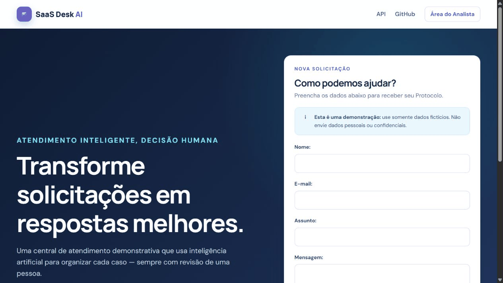

# SaaS Desk AI

> Português | [English](#english)

Uma central de atendimento de portfólio em que IA recomenda e uma pessoa decide. O Solicitante envia uma Solicitação fictícia; Celery processa a Análise assistida; o Analista revisa Categoria, Prioridade e Resposta sugerida antes da Resolução.

Links: [código-fonte](https://github.com/javalimortal-star/saas-desk-ai) · demonstração publicada (adicionar após o deploy) · Swagger publicado (adicionar após o deploy)



## Arquitetura

- Django + Django REST Framework: interface e API.
- PostgreSQL: Solicitações, Tentativas, decisões humanas e idempotência.
- Celery + Redis: análises assíncronas.
- OpenRouter: provedor real opcional; `fake` é um provedor local determinístico e explícito.
- Docker Compose: aplicação web, banco, broker e worker.

Fluxo: `Solicitante → Django → PostgreSQL → Celery/Redis → provedor → Revisão humana`.

## Executar a demonstração

Pré-requisito: Docker Desktop.

```bash
cp .env.example .env
docker compose up --build -d
docker compose exec web python manage.py seed_demo
```

- Formulário público: <http://localhost:8000/>
- Login do Analista: <http://localhost:8000/analyst/login/>
- Swagger: <http://localhost:8000/api/docs/>
- OpenAPI: <http://localhost:8000/api/schema/>

Credenciais locais padrão: `demo-analyst` / `demo-password`. O Analista recebe somente a permissão necessária e não é `staff` nem superusuário. Altere `DEMO_ANALYST_PASSWORD` fora de uma avaliação local.

Sem Redis local, use `CELERY_TASK_ALWAYS_EAGER=true` apenas para executar a tarefa no próprio processo durante uma demonstração de desenvolvimento. Produção e Docker Compose mantêm o worker separado.

## Configuração de IA

O `.env.example` contém apenas nomes e valores locais não secretos.

- `ANALYSIS_PROVIDER=fake`: avaliação local sem chave e respostas determinísticas.
- `ANALYSIS_PROVIDER=openrouter`: integração real; exige `OPENROUTER_API_KEY` e usa `OPENROUTER_MODEL`.

Não existe fallback silencioso: falhas da OpenRouter viram uma Falha na análise sanitizada e preservam a Solicitação para Tratamento manual.

## Testes e qualidade

```bash
docker compose up -d db
python -m venv .venv
# Windows: .venv\Scripts\python -m pip install -e ".[dev]"
# Linux/macOS: .venv/bin/python -m pip install -e ".[dev]"
.venv/Scripts/python -m pytest -q
.venv/Scripts/python -m ruff check .
.venv/Scripts/python -m ruff format --check .
.venv/Scripts/python manage.py makemigrations --check --dry-run
```

O GitHub Actions executa as mesmas verificações com PostgreSQL 17.

## API e segurança

`POST /api/v1/requests/` é público e devolve somente o Protocolo. Endpoints em `/api/v1/analyst/` exigem sessão e permissão de Analista. A entrada pública possui limites de tamanho, rate limit por IP com proxies confiáveis explícitos e aviso para dados fictícios. Não há consulta pública por Protocolo. `python manage.py purge_demo_data` aplica a retenção configurada e preserva trabalho ativo.

## Limitações e roadmap

Este é um SaaS demonstrativo: não envia a Resposta aprovada ao e-mail, usa autenticação por sessão e requer operação externa para backups, HTTPS, monitoramento e agendamento da retenção. Próximos passos: publicação, observabilidade, notificações e autenticação organizacional.

Para publicar, consulte [a decisão e o checklist do Render](docs/deployment.md). Os [textos de candidatura](docs/candidatura.md) conectam as evidências do projeto à vaga.

---

## English

SaaS Desk AI is a portfolio support desk where AI recommends and a human decides. A requester submits fictional data, Celery runs assisted analysis, and an analyst reviews category, priority, and suggested response before resolution.

Links: [source code](https://github.com/javalimortal-star/saas-desk-ai) · live demo (add after deployment) · live Swagger (add after deployment)


### Architecture and local run

Django/DRF serves the UI and API; PostgreSQL stores requests, attempts, human decisions, and idempotency; Celery and Redis run background jobs; OpenRouter is optional.

```bash
cp .env.example .env
docker compose up --build -d
docker compose exec web python manage.py seed_demo
```

Open <http://localhost:8000/>, sign in at <http://localhost:8000/analyst/login/> with `demo-analyst` / `demo-password`, or explore <http://localhost:8000/api/docs/>.

### AI configuration, tests, and security

Use `ANALYSIS_PROVIDER=fake` for explicit deterministic local evaluation without a key. Use `ANALYSIS_PROVIDER=openrouter` with `OPENROUTER_API_KEY` for the real integration. OpenRouter errors never silently fall back to fake output.

Install `.[dev]`, then run `python -m pytest -q`, `python -m ruff check .`, `python -m ruff format --check .`, and `python manage.py makemigrations --check --dry-run`. Public submission returns only a protocol, has input/rate limits, and cannot retrieve a request. Analyst APIs require authenticated permission. The demo retention command is repeatable and preserves active work.

### Limitations and roadmap

This demo does not email approved responses and still needs production HTTPS, backups, monitoring, and scheduled retention. Planned work includes deployment, observability, notifications, and organization-grade authentication.

See the [Render deployment decision and checklist](docs/deployment.md) and the [Portuguese application copy](docs/candidatura.md).
